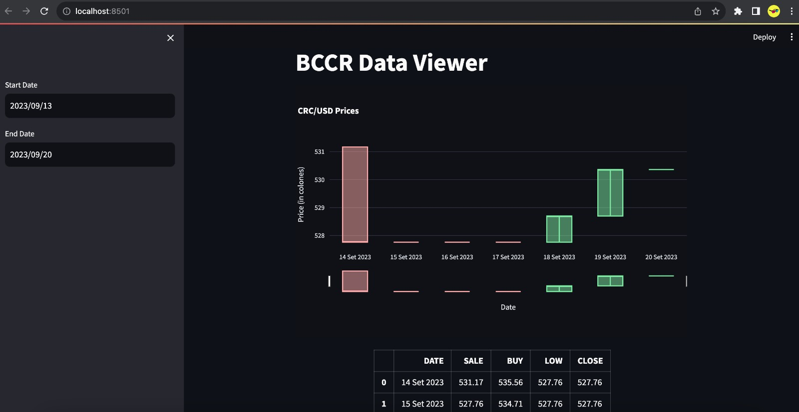

# BCCR Data Viewer

This project is a Streamlit application to view BCCR data.



## Installation

1. Clone the repository.
2. Install the necessary packages by running the command:

   ```
   python3 -m venv env

   source env/bin/activate

   pip install -r requirements.txt
   ```

## Usage

To run the application, use the command:
```
streamlit run app.py
```

Open the application in a web browser using the URL displayed in the terminal.

## License

[MIT](https://choosealicense.com/licenses/mit/)
